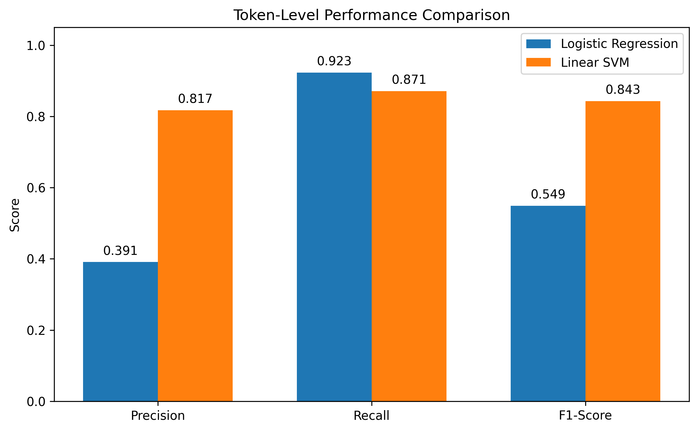
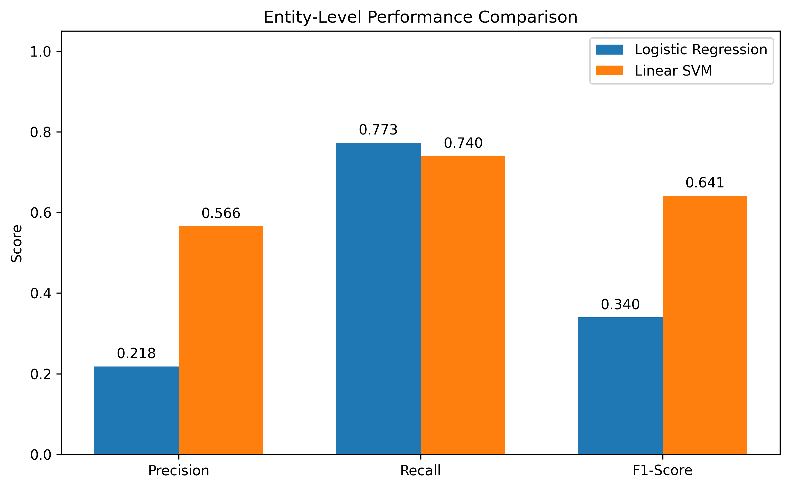

# Baseline Models for PII Detection

This folder contains baseline machine learning models for token-level Personally Identifiable Information (PII) detection.

The models used are:

- Logistic Regression
- Linear SVM

## Method

Baseline models are implemented as token-level classifiers. Each token from the dataset is converted into numerical features and classified into either a PII label or non-PII label.

The models are trained using processed datasets from the project split:

```text
data/processed/
├── train.json
├── val.json
└── test_internal.json
```

The final evaluation is performed on `test_internal.json`.

## Preprocessing

The preprocessing stage consists of:

- tokenization (provided by the dataset)
- lowercasing
- token-level feature extraction
- context feature extraction (previous and next token)
- TF-IDF vectorization using character n-grams (2–4)

Stopword removal, stemming, and lemmatization are not applied because they may remove useful information required for PII identification.

## Feature Engineering

Each token is converted into handcrafted token-level features and TF-IDF representation.

The handcrafted features used include:

- token length
- character features
- capitalization pattern
- digit pattern
- email pattern
- URL pattern
- prefix and suffix
- previous token
- next token

TF-IDF representation is used to convert token text into numerical features based on character patterns. In this experiment, TF-IDF uses character n-grams so the model can capture useful patterns inside tokens, such as email format, URL pattern, name pattern, and ID number pattern.

Context tokens are included because Logistic Regression and Linear SVM do not directly model token sequences like CRF.

## Hyperparameter

Hyperparameters are model settings defined before training. These values control how the model learns from the training data.

### Logistic Regression

```python
LogisticRegression(
    class_weight="balanced",
    max_iter=150,
    solver="saga",
    tol=1e-3,
    verbose=0
)
```

Explanation:

- `class_weight="balanced"` is used to handle class imbalance because non-PII tokens are more frequent than PII tokens.
- `max_iter=150` sets the maximum number of optimization iterations.
- `solver="saga"` is used because it supports large-scale sparse features.
- `tol=1e-3` controls the stopping tolerance. A larger tolerance helps training finish faster.
- `verbose=0` disables detailed training logs.

### Linear SVM

```python
LinearSVC(
    class_weight="balanced",
    max_iter=1000,
    tol=1e-3
)
```

Explanation:

- `class_weight="balanced"` is used to reduce the effect of class imbalance.
- `max_iter=1000` sets the maximum number of training iterations.
- `tol=1e-3` controls the stopping tolerance during optimization.

## Run Training

Train the baseline models and generate predictions, metrics, and trained model files:

```bash
python models/baseline/train_baseline.py
```

## Outputs

### Predictions

Generated prediction files:

```text
results/predictions/logistic_regression_predictions.csv
results/predictions/linear_svm_predictions.csv
```

CSV format:

```text
document_id,token,true_label,pred_label
```

### Metrics

Generated evaluation metrics:

```text
results/metrics/logistic_regression_metrics.json
results/metrics/linear_svm_metrics.json
```

### Trained Models

Saved trained models:

```text
models/baseline/logistic_regression_model.joblib
models/baseline/linear_svm_model.joblib
```

## Results

### Performance Visualization

#### Token-Level Performance Comparison



#### Entity-Level Performance Comparison



### Logistic Regression

```text
Token-level Precision : 0.3909
Token-level Recall    : 0.9230
Token-level F1-score  : 0.5492

Entity-level Precision: 0.2177
Entity-level Recall   : 0.7730
Entity-level F1-score : 0.3398
```

Logistic Regression achieved high recall but lower precision. This means the model can detect many PII tokens, but still produces more false positives compared to Linear SVM.

### Linear SVM

```text
Token-level Precision : 0.8172
Token-level Recall    : 0.8708
Token-level F1-score  : 0.8431

Entity-level Precision: 0.5660
Entity-level Recall   : 0.7397
Entity-level F1-score : 0.6413
```

Linear SVM achieved better and more balanced performance compared to Logistic Regression.

## Short Analysis

Logistic Regression has a strong recall score, meaning it can detect many PII tokens. However, its precision is lower, indicating that it still predicts some non-PII tokens as PII.

Linear SVM performs better as a baseline model. It produces a more balanced result between precision and recall, with a token-level F1-score of 0.8431 and an entity-level F1-score of 0.6413.

The updated dataset improves baseline performance significantly compared to the previous dataset, especially for Logistic Regression.

## Conclusion

Linear SVM is the stronger baseline model in this experiment. It provides a better balance between precision and recall and can be used as the main baseline comparison for CRF, boosting models, ensemble models, and deep learning models.