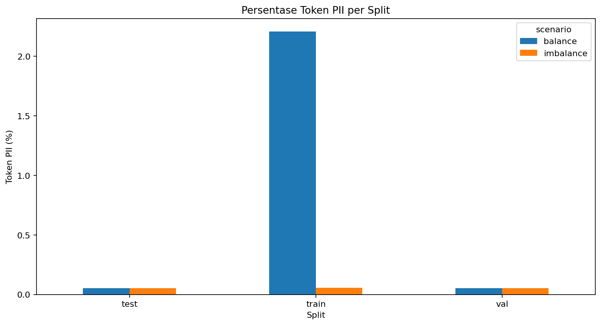
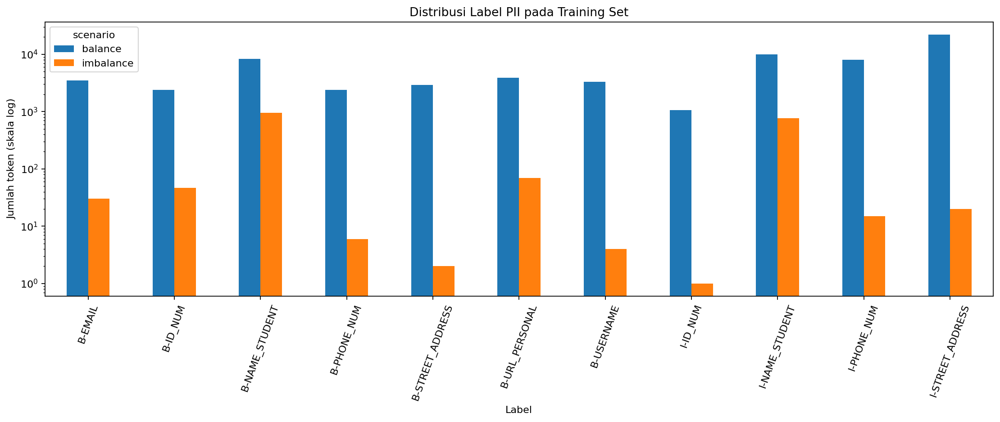
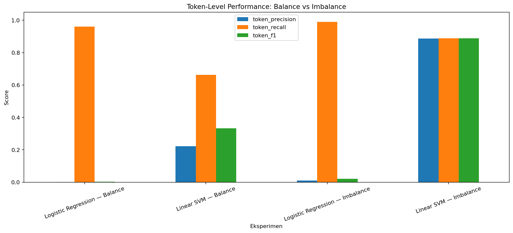
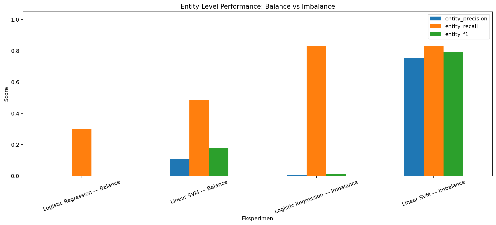
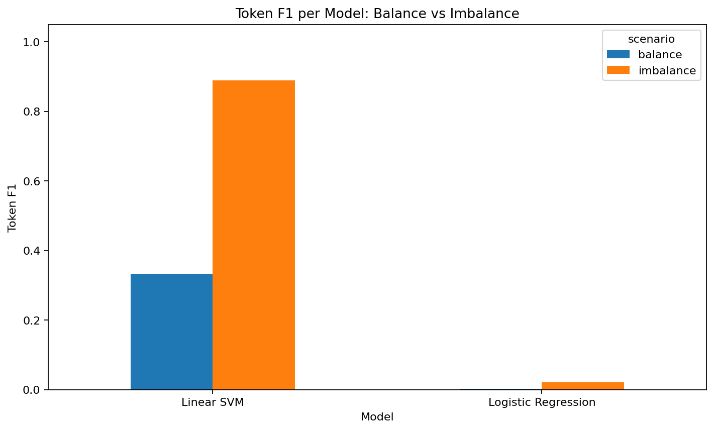
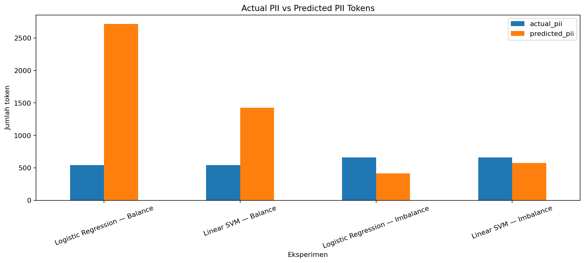
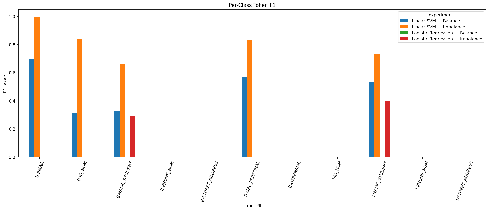

# Baseline Models for PII Detection

Folder ini berisi implementasi dan hasil eksperimen baseline machine learning untuk deteksi **Personally Identifiable Information (PII)** pada level token.

Model yang digunakan:

- Logistic Regression
- Linear SVM

Notebook utama yang digunakan untuk eksperimen:

```text
models/baseline/baseline_notebook.ipynb
```

Notebook ini membandingkan dua skenario dataset:

- `balance`
- `imbalance`

## Method

Baseline model dibuat sebagai **token-level classifier**. Setiap token pada dokumen diubah menjadi fitur numerik, kemudian diklasifikasikan ke salah satu label PII atau label non-PII (`O`).

Eksperimen dilakukan pada dua skenario dataset:

```text
data/processed/
├── balance/
│   ├── train.json
│   ├── val.json
│   └── test.json
└── imbalance/
    ├── train.json
    ├── val.json
    └── test.json
```

Pada setiap skenario:

- `train.json` digunakan untuk melatih model.
- `val.json` digunakan untuk validasi dan pengecekan eksperimen.
- `test.json` digunakan untuk evaluasi akhir skenario tersebut.

Evaluasi dilakukan dengan membandingkan `true_label` dan `pred_label` pada hasil prediksi test set.

## Preprocessing

Tahap preprocessing terdiri dari:

- tokenization, yang sudah disediakan oleh dataset
- lowercasing
- token-level feature extraction
- context feature extraction menggunakan token sebelum dan sesudah
- TF-IDF vectorization menggunakan character n-gram 2 sampai 4

Stopword removal, stemming, dan lemmatization tidak digunakan karena task ini adalah PII detection / token classification. Proses tersebut dapat menghilangkan informasi penting seperti nama, email, username, ID number, URL, atau alamat.

## Feature Engineering

Setiap token diubah menjadi gabungan fitur manual dan fitur TF-IDF.

### Handcrafted Features

Fitur manual yang digunakan meliputi:

- token lowercase
- token length
- character shape
- capitalization and digit flags
- email and URL pattern
- prefix and suffix
- previous token context
- next token context

### TF-IDF Features

TF-IDF digunakan untuk mengubah teks token menjadi fitur numerik berdasarkan pola karakter.

Konfigurasi TF-IDF:

```python
TfidfVectorizer(
    analyzer="char_wb",
    ngram_range=(2, 4),
    min_df=2
)
```

Character-level TF-IDF membantu model mengenali pola dalam token, misalnya:

- pola email seperti `@`, `gmail`, `.com`
- pola URL seperti `http`, `www`, `.com`
- pola ID number yang banyak mengandung angka
- pola nama atau username

Fitur konteks juga digunakan karena Logistic Regression dan Linear SVM tidak memodelkan urutan token secara langsung seperti CRF.

## Hyperparameter

Hyperparameter adalah pengaturan model yang ditentukan sebelum training.

### Logistic Regression

```python
LogisticRegression(
    class_weight="balanced",
    max_iter=150,
    solver="saga",
    tol=1e-3,
    verbose=0,
    random_state=42
)
```

Penjelasan:

- `class_weight="balanced"` digunakan untuk membantu model memperhatikan kelas PII yang jumlahnya lebih sedikit dibanding label `O`.
- `max_iter=150` membatasi jumlah iterasi optimasi agar training tetap feasible.
- `solver="saga"` cocok untuk fitur sparse dan berdimensi besar seperti hasil TF-IDF.
- `tol=1e-3` mengatur batas toleransi berhenti training.
- `verbose=0` mematikan log detail selama training.
- `random_state=42` digunakan agar hasil lebih reproducible.

### Linear SVM

```python
LinearSVC(
    class_weight="balanced",
    max_iter=1000,
    tol=1e-3,
    random_state=42
)
```

Penjelasan:

- `class_weight="balanced"` digunakan untuk mengurangi dampak class imbalance.
- `max_iter=1000` membatasi jumlah iterasi training.
- `tol=1e-3` menentukan batas toleransi konvergensi.
- `random_state=42` digunakan agar hasil eksperimen lebih konsisten.

## Run Training

Jalankan notebook berikut untuk menjalankan seluruh eksperimen dan menghasilkan model, prediksi, metrics, serta grafik:

```text
models/baseline/baseline_notebook.ipynb
```

Script training utama juga tersedia pada:

```bash
python models/baseline/train_baseline.py
```

## Outputs

### Trained Models

Notebook menghasilkan model berikut:

```text
models/baseline/logistic_regression_balance_model.joblib
models/baseline/linear_svm_balance_model.joblib
models/baseline/logistic_regression_imbalance_model.joblib
models/baseline/linear_svm_imbalance_model.joblib
```

### Predictions

Output prediksi yang dihasilkan notebook:

```text
results/predictions/logistic_regression_balance_predictions.csv
results/predictions/linear_svm_balance_predictions.csv
results/predictions/logistic_regression_imbalance_predictions.csv
results/predictions/linear_svm_imbalance_predictions.csv
```

Format CSV:

```text
document_id,token,true_label,pred_label
```

### Metrics

Output metrics yang dihasilkan notebook:

```text
results/metrics/logistic_regression_balance_metrics.json
results/metrics/linear_svm_balance_metrics.json
results/metrics/logistic_regression_imbalance_metrics.json
results/metrics/linear_svm_imbalance_metrics.json
```

### Plots

Grafik pendukung disimpan pada:

```text
models/baseline/plots/dataset_pii_ratio.png
models/baseline/plots/train_pii_label_distribution.png
models/baseline/plots/baseline_token_metrics_comparison.png
models/baseline/plots/baseline_entity_metrics_comparison.png
models/baseline/plots/baseline_f1_balance_vs_imbalance.png
models/baseline/plots/actual_vs_predicted_pii.png
models/baseline/plots/baseline_per_class_f1.png
```

## Dataset Statistics

### PII Ratio per Split



Grafik ini menunjukkan perbandingan rasio token PII pada skenario balance dan imbalance. Pada train split, dataset balance memiliki rasio token PII lebih tinggi dibanding dataset imbalance.

Berdasarkan hasil notebook:

```text
PII ratio train balance   : 2.2073%
PII ratio train imbalance : 0.0551%
Perbandingan              : 40.07 kali
```

### Train PII Label Distribution



Grafik ini memperlihatkan distribusi label PII pada training set. Label `O` tidak ditampilkan agar distribusi label PII dapat dibaca lebih jelas.

## Results

### Token-Level Metrics Comparison



Token-level evaluation menghitung benar atau salahnya prediksi pada setiap token. Semakin tinggi precision, recall, dan F1-score, semakin baik model dalam mendeteksi token PII.

### Entity-Level Metrics Comparison



Entity-level evaluation lebih ketat karena menilai apakah entitas PII lengkap berhasil dikenali. Misalnya nama lengkap yang terdiri dari beberapa token harus terdeteksi sebagai satu entity yang benar.

### F1 Balance vs Imbalance



Grafik ini memperlihatkan perbandingan token F1 antara skenario balance dan imbalance untuk Logistic Regression dan Linear SVM.

### Actual vs Predicted PII



Grafik ini membandingkan jumlah token PII sebenarnya dengan jumlah token yang diprediksi sebagai PII. Grafik ini membantu melihat apakah model terlalu agresif menandai token sebagai PII.

### Per-Class F1



Grafik ini menunjukkan performa F1 untuk setiap label PII. Analisis per kelas penting karena micro F1 dapat didominasi oleh label yang jumlahnya lebih banyak.

## Experiment Results

### Balance Scenario

| Model | Token Precision | Token Recall | Token F1 | Entity Precision | Entity Recall | Entity F1 | Predicted PII | False Positive Non-PII | Missed PII |
|---|---:|---:|---:|---:|---:|---:|---:|---:|---:|
| Logistic Regression | 0.0009 | 0.9605 | 0.0018 | 0.0002 | 0.3008 | 0.0004 | 704,546 | 703,888 | 0 |
| Linear SVM | 0.2224 | 0.6626 | 0.3331 | 0.1089 | 0.4881 | 0.1781 | 1,960 | 1,492 | 190 |

Pada skenario balance, Linear SVM menjadi model terbaik dengan token F1 sebesar `0.3331` dan entity F1 sebesar `0.1781`.

### Imbalance Scenario

| Model | Token Precision | Token Recall | Token F1 | Entity Precision | Entity Recall | Entity F1 | Predicted PII | False Positive Non-PII | Missed PII |
|---|---:|---:|---:|---:|---:|---:|---:|---:|---:|
| Logistic Regression | 0.0107 | 0.9894 | 0.0212 | 0.0063 | 0.8311 | 0.0125 | 60,621 | 59,964 | 1 |
| Linear SVM | 0.8877 | 0.8891 | 0.8884 | 0.7524 | 0.8338 | 0.7910 | 659 | 73 | 72 |

Pada skenario imbalance, Linear SVM juga menjadi model terbaik dengan token F1 sebesar `0.8884` dan entity F1 sebesar `0.7910`.

## Short Analysis

Berdasarkan hasil notebook, Linear SVM menjadi model terbaik pada kedua skenario. Model ini lebih stabil dibanding Logistic Regression karena menghasilkan precision, recall, dan F1-score yang lebih seimbang.

Logistic Regression memiliki kecenderungan terlalu agresif dalam menandai token sebagai PII. Hal ini terlihat dari jumlah `predicted_pii` dan false positive yang sangat tinggi, terutama pada skenario balance.

Pada skenario balance, Linear SVM dipilih sebagai baseline akhir karena notebook menetapkan pemilihan akhir hanya berdasarkan hasil dataset balance. Model terpilih adalah:

```text
Linear SVM
Token Precision : 0.2224
Token Recall    : 0.6626
Token F1        : 0.3331
Entity F1       : 0.1781
```

Hasil skenario imbalance tidak digunakan sebagai keputusan final, tetapi tetap ditampilkan sebagai pembanding untuk memahami pengaruh distribusi dataset terhadap performa model.

## Data Integrity Note

Notebook mendeteksi beberapa peringatan pada pemeriksaan split, termasuk document ID overlap dan duplicate document ID pada skenario tertentu. Oleh karena itu, hasil ini sebaiknya dibaca sebagai hasil eksperimen notebook yang sudah dijalankan, tetapi split dataset tetap perlu diverifikasi kembali apabila hasil akan digunakan sebagai evaluasi final resmi.

Catatan dari notebook:

- Balance train memiliki duplicate document ID `-1`.
- Terdapat overlap antara validation dan test pada kedua skenario.
- Pada skenario imbalance, terdapat overlap antara train dan test.
- Test set balance dan imbalance tidak identik.

Jika evaluasi final harus benar-benar fair, split perlu diperbaiki agar tidak ada document ID yang muncul di lebih dari satu split.

## Conclusion

Linear SVM merupakan baseline model terbaik pada eksperimen notebook ini. Model tersebut unggul pada skenario balance maupun imbalance. Untuk keputusan baseline akhir berdasarkan dataset balance, Linear SVM dipilih karena memperoleh token F1 tertinggi dibanding Logistic Regression.

Namun, karena notebook juga mendeteksi warning pada integritas split, hasil metrik perlu diinterpretasikan dengan hati-hati. Untuk evaluasi final yang lebih kuat, dataset split sebaiknya diverifikasi ulang agar train, validation, dan test benar-benar tidak saling tumpang tindih.
